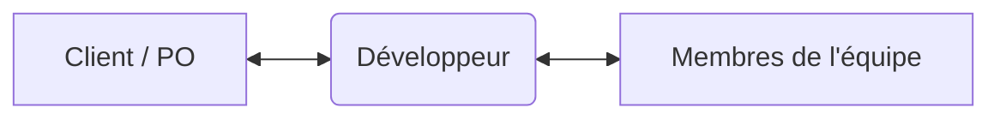

# Les compétences transverses du Développeur Web

**Au-delà du code, de Git et de Docker**
*Comprendre l'écosystème pour mieux collaborer*

---

## Sommaire

1. **La culture Web & SEO** (Le contexte)
2. **L'Accessibilité & l'Éco-conception** (L'éthique et la loi)
3. **La Sécurité & la RGPD** (La protection)
4. **La Communication & l'Agilité** (Le travail en équipe)

---

## 1. La Culture Web & le SEO

Pour qui écrit-on du code ? Pour des utilisateurs et des moteurs de recherche.

* **Le SEO technique (Référencement naturel) :**
    * Structure HTML sémantique (`<main>`, `<article>`, `<nav>`).
    * Vitesse de chargement (Core Web Vitals).
* **L'hébergement et les domaines :**
    * Comprendre le fonctionnement d'un DNS.
    * Différence entre HTTP et HTTPS (Certificats SSL).

---

## 2. Accessibilité (numérique) & Éco-conception

Le web doit être durable et ouvert à tous.

### Accessibilité (RGAA / WCAG)
* Rendre le site utilisable pour les personnes en situation de handicap (visuel, moteur, cognitif).
* *Exemple :* Renseigner les attributs `alt` des images, gérer le contraste des couleurs.

### Éco-conception
* Réduire l'impact écologique des lignes de code.
* *Exemple :* Nettoyer le code inutile, optimiser le poids des images.

---

## 3. Sécurité & RGPD

Un bon code est un code sûr qui respecte la loi.

* **Sécurité de base (OWASP) :**
    * Savoir identifier et éviter les pièges simples (Injections SQL, failles XSS).
    * Ne jamais faire confiance aux données saisies par l'utilisateur.
* **RGPD (Données personnelles) :**
    * Demander le consentement avant de stocker des cookies.
    * Sécuriser et limiter la collecte des données privées au strict minimum.

---

## 4. Communication & Gestion de projet

Le code ne représente souvent que la moitié du travail d'un développeur.

