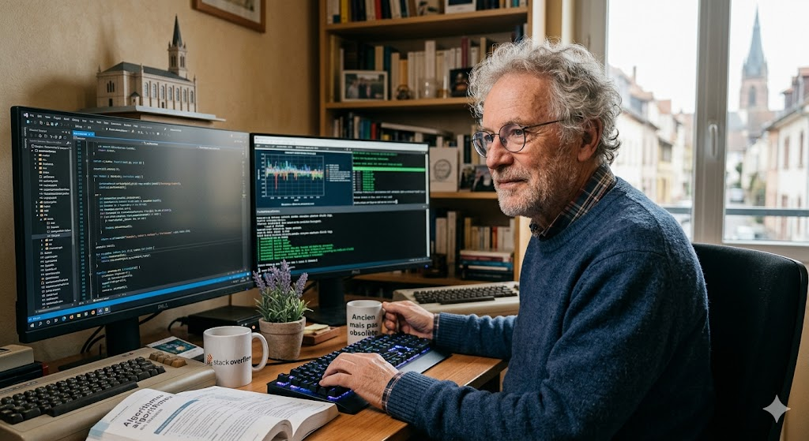
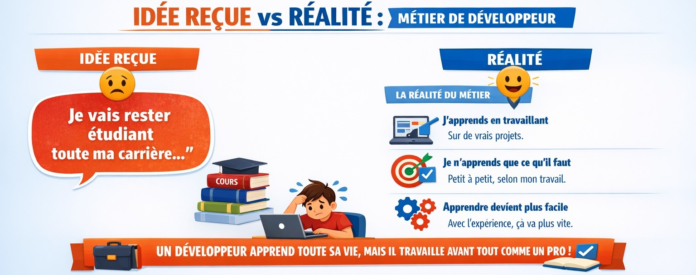
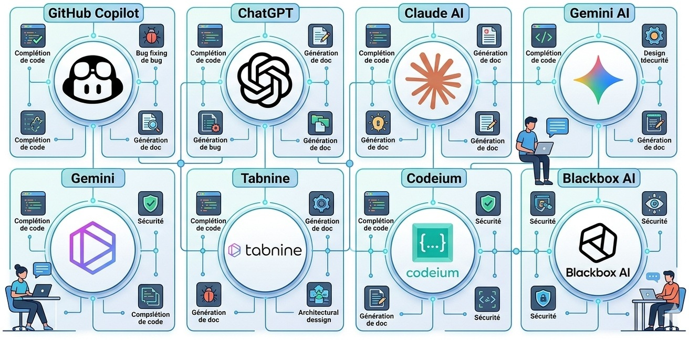
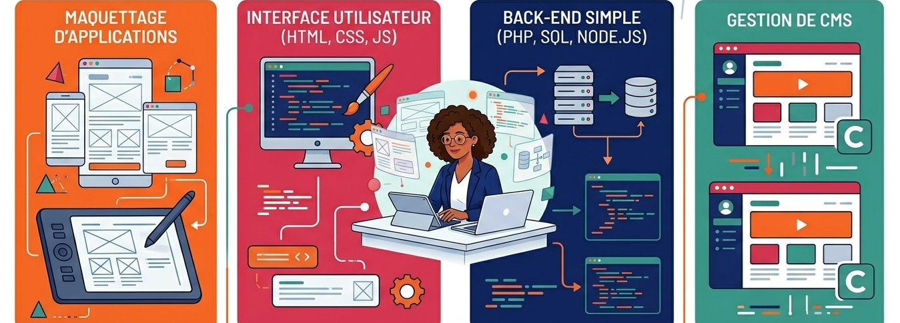
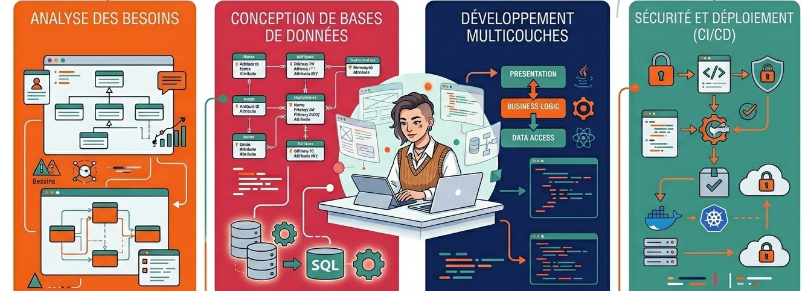
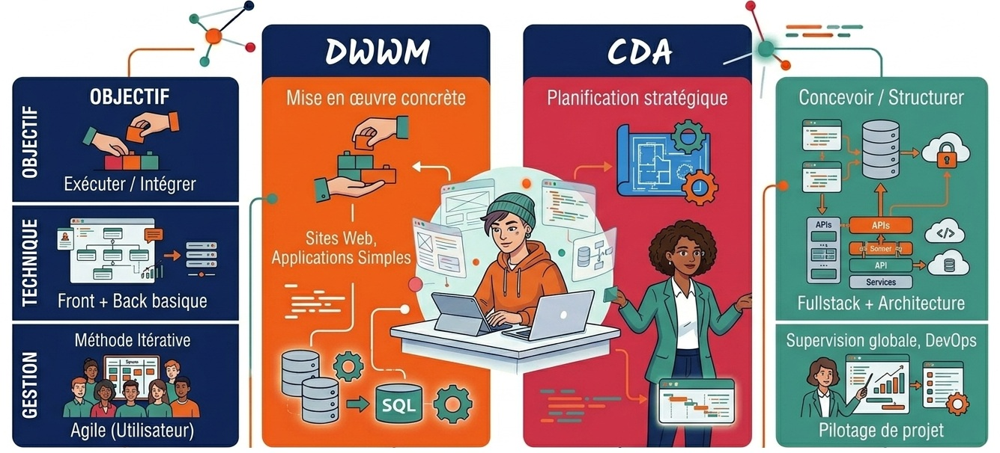
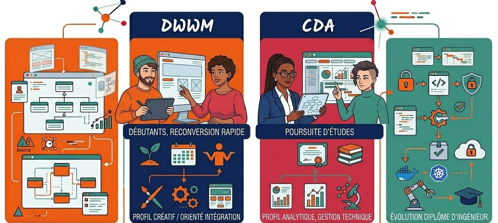
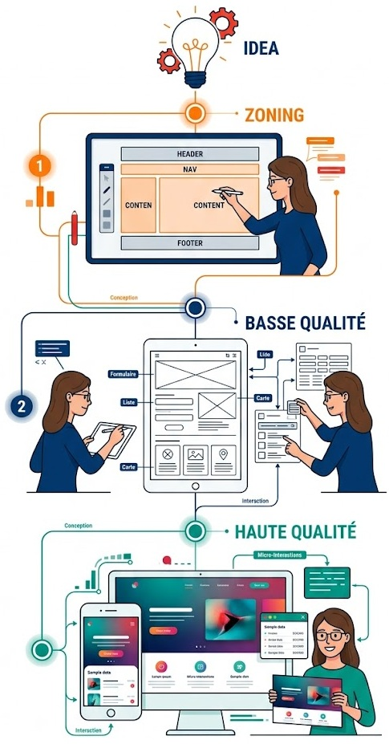
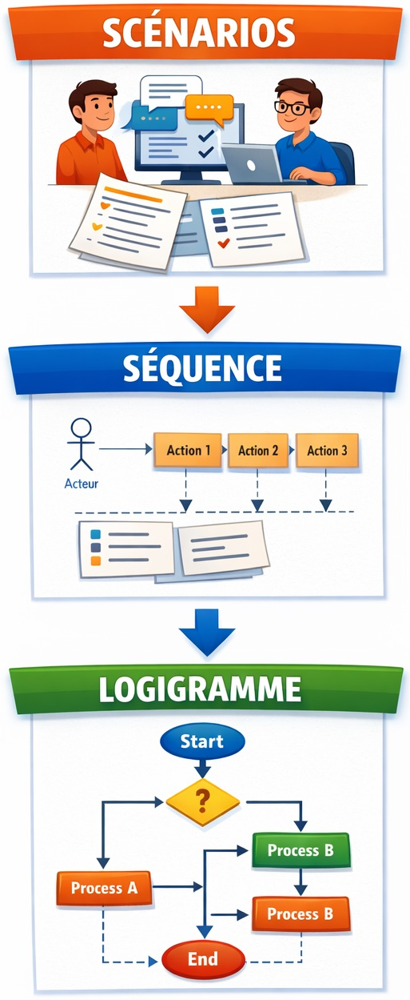
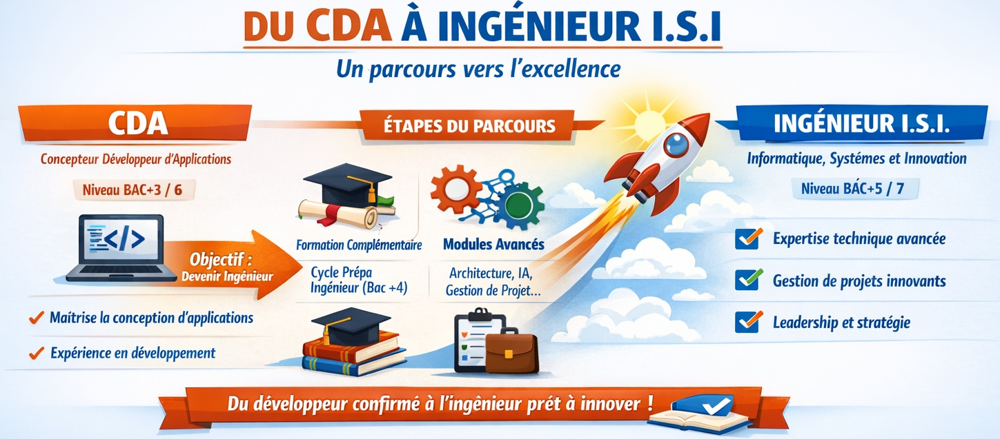

# Centre de Réadaptation de Mulhouse

## Présentation des formations DWWM, CDA et Ingénieur

**Formateurs :**
- Sophie THIRY 
    - Conception et Gestion de Projet
- Franck CHATELOT 
    - Bases de données et développement backend
- Mickaël DEVOLDÈRE
    - Sécurité, accessibilité, développement frontend et déploiement

---

# DWWM & CDA : Quel parcours choisir ?

**Comprendre les différences**
* Titre professionnel Développeur Web et Web Mobile (Niveau 5)
* Titre professionnel Concepteur Développeur d'Application (Niveau 6)

---

## Avant de rentrer dans le vif du sujet...

* Votre Vision sur les développeurs !
* Réalité ou idée reçue ?

--- 

## Je vais devenir riche
* ❌ FAUX
* 

---

## Je suis trop "vieux"

* ❌ FAUX
* Le développement n'est pas réservé aux "jeunes en sweat à capuche". 
* La maturité est un atout majeur.
    * ✅ Votre expérience passée (gestion, relation client) est précieuse.
    * ✅ Les entreprises recherchent de la stabilité et de la rigueur.
    * ✅ Les meilleures équipes sont intergénérationnelles.

---

## Il faut être un génie en maths

* ❌ FAUX
* 

---

## C'est un métier solitaire

* ❌ FAUX
* Au contraire, on passe beaucoup de temps à **échanger en équipe** et avec les clients.

---

## On passe sa journée à taper du code
* ❌ FAUX
* 

---

## Le diplôme est ROI

* ✅ VRAI et ❌ FAUX
* Si un diplôme ouvre des portes, le secteur du web est l'un des plus ouvert aux parcours atypiques.
* **Ce qui compte vraiment** : 
    * Votre portfolio
    * Vos projets sur GitHub
    * Votre capacité à résoudre des problèmes concrets lors des tests techniques.

---

## Je dois tout savoir par coeur

* Totalement ❌ FAUX
* **Personne** ne sait tout par cœur
* Ce qui compte, ce sont les **concepts**, pas la syntaxe
* Le travail réel se fait avec des outils d’aide
* Un bon développeur n’est pas celui qui sait tout par cœur...
    * il est celui qui **comprend**, qui **sait chercher** et qui **sait vérifier**.
---

## Je vais rester "étudiant" toute ma carrière

* ✅ VRAI
* ❌ Mais...

---

## Je vais rester "étudiant" toute ma carrière

---

## Le secret des pros

* 
* ~20% du temps de travail est de la recherche pure...

---

## Le secret des pros

* 

---

## On ne sait pas tout !

* 95% des développeurs utilisent un moteur de recherche au quotidien
    * Et aujourd'hui, se font assister par les IA génératives...
* Un développeur n'est pas une encyclopédie vivante. 
    * Son talent réside dans sa capacité à trouver l'information au bon moment.
* La documentation et les communautés sont vos meilleurs alliés, même après 10 ans de carrière.

---

# Contenu des formations DWWM et CDA

---

## DWWM

---

## CDA

---

## Comparaison Rapide

---

## Quel profil pour quelle formation ?

---

## Profil d'Entrée DWWM : Aptitudes Requises
**Savoirs et Savoir-être pour intégrer le cursus.**

| Catégorie | Aptitudes |
| :--- | :--- |
| **Savoirs** | Culture numérique de base, logique algorithmique. Bases en HTML/CSS fortement recommandé. |
| **Savoir-faire** | Navigation web, bureautique, Anglais technique (lecture), savoir utiliser un terminal, savoir suivre un tutoriel. |
| **Savoir-être** | Humilité, curiosité, persévérance, autonomie, esprit d'analyse, rigueur méthodologique. |

---

## Profil d'Entrée CDA : Aptitudes Requises
**Savoirs et Savoir-être pour intégrer le cursus.**

| Catégorie | Aptitudes |
| :--- | :--- |
| **Savoirs** | Culture numérique, logique algorithmique. Connaissance d'un langage objet souhaitée. |
| **Savoir-faire** | Navigation web, bureautique, Anglais technique (lecture), savoir utiliser un terminal, savoir suivre un tutoriel. |
| **Savoir-être** | Humilité, curiosité, persévérance, capacité d'abstraction, autonomie, esprit d'analyse, rigueur méthodologique, esprit critique technique, capacité à justifier ses choix. |

---

# Aptitudes: Synthèse comparative

| Dimension           | DWWM                | CDA                     |
| ------------------- | ------------------- | ----------------------- |
| Niveau              | Débutant / Junior   | Intermédiaire / Avancé  |
| Autonomie           | Faible → moyenne    | Moyenne → forte         |
| Attente pédagogique | Apprendre à faire   | Apprendre à concevoir   |
| Rapport au code     | Exécuter / modifier | Comprendre / structurer |
| IA (tolérance)      | Aide encadrée       | Outil critique          |

---

## Profil de Sortie : Compétences Visées
**Savoir-faire opérationnels après certification.**

### DWWM : L'Exécutant Technique
* Créer des interfaces web statiques et dynamiques.
* Développer la partie back-end d'une application web.
* Maîtriser l'affichage adaptatif et l'accessibilité numérique.

### CDA : L'Architecte Solution
* Concevoir une architecture logicielle complexe.
* Piloter la qualité du code via des plans de tests.
* Automatiser le déploiement (DevOps de base).

---

## Soft Skills en Sortie (Savoir-être)

* **Adaptabilité** : Veille technologique constante pour s'ajuster aux évolutions.
* **Communication** : Capacité à traduire un besoin métier en solution technique.
* **Collaboration** : Travail en équipe via des outils collaboration.
* **Éthique** : Sensibilisation à l'éco-conception et à la protection des données (RGPD).
* **Esprit critique** : Capacité à remettre en question une solution (la sienne ou celle proposée par un outil/une IA), à identifier ses limites et à proposer des améliorations.
* **Responsabilité professionnelle** : Prise de conscience de l’impact de ses choix techniques (sécurité, performance, maintenance, dette technique) sur le produit et sur l’équipe.

---

## Approche Pédagogique : Unified Process
**Une méthodologie structurée pour chaque projet.**

L'apprenant ne code pas immédiatement ; il suit un cycle de conception rigoureux :

1. **Cadrage** : Comprendre le besoin client.
2. **Cas d'usage** : Définir le périmètre fonctionnel.
3. **Maquettage** : Modéliser l'interface (UI/UX).
4. **Scénarios** : Décrire le parcours utilisateur.
5. **Séquence** : Prévoir les échanges techniques.

---

## De la Logique à la Mise en Production

6. **Algorithmes** : Déterminer la logique de traitement.
7. **Intégration** : Créer la structure visuelle.
8. **Implémentation** : Développer la logique métier.
9. **Tests (CI)** : Contrôle qualité automatisé.
10. **Déploiement (CD)** : Mise en production.
11. **Formation** : Accompagner l'utilisateur final.

---

## Deux métiers, deux approches

### Le Développeur Web (DWWM) : "L'Artisan Constructeur"
* **Son rôle :** Donner vie au projet. Il se concentre sur ce que l'utilisateur voit et utilise.
* **Ses priorités :** 
    * Créer le design et les écrans.
    * S'assurer que les boutons et les formulaires fonctionnent.
    * Livrer un site joli, rapide et facile à utiliser.

--- 

## Deux métiers, deux approches

### Le Concepteur (CDA) : "L'Architecte Ingénieur"
* **Son rôle :** Il construit la structure invisible et solide. Il prévoit comment le projet va grandir.
* **Ses priorités :**
    * Dessiner les plans complexes (l'organisation des données).
    * Automatiser les vérifications pour éviter les pannes.
    * Garantir que le système est sécurisé et facile à réparer dans 2 ans.

---

## CDA ouvre la porte au diplôme d'ingénieur

---

## Débouchés & Évolutions du Marché
**Vers les métiers de demain.**

### Métiers Classiques
* **Post-DWWM :** Développeur Web, Intégrateur Front-end, Développeur CMS.
* **Post-CDA :** Développeur Fullstack, Concepteur Logiciel, Lead Developer, Chef de projet.

### Évolutions & Nouveaux Enjeux (Horizon 2028+)
* **IA & Automatisation :** Développeur assisté par IA (Prompt Engineering, Copilot).
* **Green IT :** Développeur d'applications sobres (Éco-conception).
* **Cybersécurité :** Développeur "Security-by-Design".
* **Low-Code/No-Code :** Architecte hybride (intégrant solutions SaaS et code métier).

---

## Évolution de Carrière
1. **Technique :** Architecte Cloud, Expert Technique, Expert Cybersécurité.
2. **Management :** Product Owner, Scrum Master, CTO (Directeur Technique).
3. **Data :** Ingénieur Data, Analyste de données.

--- 

## Intégrer la formation

* Définir son projet professionnel **<-- VOUS ÊTES ICI**
* Constituer un dossier MDPH
* Formuler une demande d’orientation professionnelle
* Déposer le dossier auprès de la MDPH
* Attendre la notification d’orientation (CDAPH)
* Intégrer la formation après validation 
--- 

## En attendant d'intégrer la formation

* Initier votre veille technologique
    * [Comprendre le Web](https://openclassrooms.com/fr/courses/1946386-comprendre-le-web)
    * [Découvrir les métiers du développement](https://openclassrooms.com/fr/courses/6817086-decouvrez-les-metiers-de-developpeur)
    * [Le site de référence des développeurs: Developpez.com](https://www.developpez.com/)
